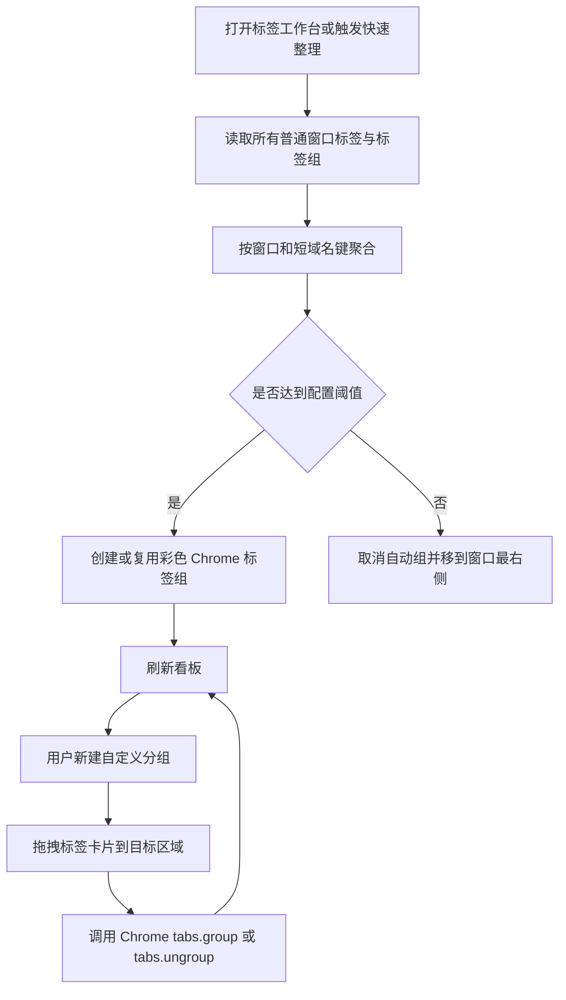

# Tabloom Chrome 插件产品需求文档

## 1. 产品概述

Tabloom 是一款面向多标签页工作流的 Chrome 扩展，解决大量 Merlin 页面标题相同、定位困难，以及标签页缺少清晰分组的问题。

- 核心用户：同时打开多个 Merlin 任务、训练页面或内部工具页面的研发人员。
- 核心价值：用自定义标题快速辨认标签页，并通过域名分组与颜色编码降低查找成本。

## 2. 核心功能

### 2.1 功能模块

1. **工具栏弹窗**：查看当前标签、自定义标题、快速整理未分组标签、进入标签工作台。
2. **页面右键菜单**：在网页内容区右键后选择“重命名当前标签页”。
3. **键盘快捷键**：快速唤起当前标签页的重命名输入框。
4. **标签工作台**：按 Chrome 窗口展示标签与分组，支持自动按域名分组、新建自定义分组和拖拽调整。
5. **设置与状态**：控制是否自动处理新标签，展示受限页面和分组范围提示。

### 2.2 页面与入口详情

| 页面或入口 | 模块 | 功能说明 |
|---|---|---|
| 工具栏弹窗 | 当前标签摘要 | 展示站点图标、原始标题、自定义标题和域名 |
| 工具栏弹窗 | 标题编辑 | 输入、保存或清除当前标签页的自定义标题 |
| 工具栏弹窗 | 快速整理 | 一次将所有普通窗口的网页按域名阈值整理 |
| 工具栏弹窗 | 阈值与取消 | 配置 `2–20` 的分组阈值，或取消所有窗口标签组 |
| 页面右键菜单 | 重命名入口 | 在网页内容区右键菜单中触发原生输入框并保存标题 |
| 键盘快捷键 | 快速重命名 | 默认使用 `Command+Shift+E`（macOS）或 `Ctrl+Shift+E`（Windows/Linux）触发 |
| 标签工作台 | 窗口切换 | 选择一个 Chrome 窗口作为当前管理范围 |
| 标签工作台 | 分组看板 | 以彩色分组列展示标签卡片，同时展示未分组区域 |
| 标签工作台 | 自动域名分组 | 按主机名前两段创建短名称分组，并迁移旧版完整域名组 |
| 标签工作台 | 新建自定义分组 | 输入组名并选择 Chrome 支持的分组颜色 |
| 标签工作台 | 拖拽调整 | 将标签卡片拖到现有组、新建组或未分组区域 |
| 标签工作台 | 标签操作 | 激活标签、关闭标签、重命名标签、折叠或展开 Chrome 标签组 |
| 标签工作台 | 历史操作 | 撤销上一步分组，或恢复到 Tabloom 首次修改前的分组 |
| 标签工作台 | 自动整理开关 | 新建或更新标签时，仅对尚未人工分组的标签执行自动域名分组 |

### 2.3 业务规则

- 自定义标题以标签页实例为单位保存，刷新页面后仍生效，关闭标签后清理。
- 页面脚本会监听网站自身对 `document.title` 的修改，并重新应用用户标题。
- 清除自定义标题后恢复网站当前原始标题，并停止覆盖网站后续更新。
- `chrome://`、Chrome Web Store、扩展页等受限页面无法注入标题脚本，需要显示明确提示。
- 自动分组仅作用于同一个 Chrome 窗口；Chrome 原生标签组不能跨窗口。
- 一次整理可对所有窗口生效，但每个窗口独立计数和创建组，禁止跨窗口移动或合并标签。
- 域名分组以主机名前两段为键并使用短名称，例如 `ml.bytedance.net` 显示为 `ml-bytedance`、`code.byted.org` 显示为 `code-byted`；忽略 URL 端口和 `www` 前缀。
- 旧版完整域名或单段域名自动组在再次整理时合并到对应短名称组。
- 自动整理默认不改动已有原生标签组，避免覆盖用户的手工分组结果。
- Chrome 原生仅支持九种标签组颜色；自动组按标签栏顺序轮用全部九色，并以高对比序列避免相邻组同色或近似色。
- 手工拖拽后的分组优先级高于自动分组；拖到“未分组”区域后保持未分组，直至用户再次主动整理。
- 分组修改前保存会话快照，最多保留 20 步；恢复初始分组本身也可撤销。
- 分组阈值默认 3，每个窗口独立计数；不足阈值的自动标签保持未分组并移到该窗口最右侧。
- 关闭组内标签后重新计算原窗口，剩余数量低于阈值时自动取消该组。
- 用户主动整理时遍历所有普通 Chrome 窗口；取消分组同样作用于所有窗口，但不修改自动整理开关，后续标签事件仍按阈值整理。

### 2.4 平台限制

- Chrome 扩展 API 不支持向浏览器标签栏本身的右键菜单添加自定义项。
- 本产品将“右键重命名”放在网页内容区的右键菜单中，另外提供工具栏弹窗和键盘快捷键。
- 浏览器保留部分快捷键组合；用户可以在 `chrome://extensions/shortcuts` 中修改快捷键。

## 3. 核心流程

### 3.1 标签重命名

### 3.2 自动与手工分组

## 4. 用户界面设计

### 4.1 设计风格

- 方向：桌面优先的“浏览器控制台”，强调高信息密度、快速扫描和明确状态。
- 主色：深墨蓝 `#101820`；工作区底色为暖灰 `#F2F0EA`；强调色为信号橙 `#FF6B35`。
- 分组色：严格映射 Chrome 原生九色，采用蓝、橙、绿、紫、黄、青、红、灰、粉的高对比循环，并用边框、标题条和浅色底共同编码。
- 字体：界面优先使用紧凑的人文无衬线字体，数字和域名使用等宽字体；通过本地字体回退保证离线可用。
- 按钮：小圆角、清晰边框、按下位移反馈；危险操作使用低饱和红色。
- 图标：使用内联 SVG 图标，不依赖网络资源。
- 动效：看板加载采用短暂分层淡入；拖拽时突出目标列，避免持续或装饰性过强的动画。

### 4.2 页面设计概览

| 页面 | 模块 | 界面元素 |
|---|---|---|
| 工具栏弹窗 | 标题编辑 | 站点图标、域名标签、单行输入框、保存与清除按钮、快捷键提示 |
| 工具栏弹窗 | 整理入口 | 自动整理按钮、自动开关、进入工作台的主操作按钮 |
| 标签工作台 | 顶部控制栏 | 产品标识、窗口选择器、搜索框、自动整理按钮、自动开关 |
| 标签工作台 | 分组看板 | 横向可滚动列、彩色组头、标签数量、折叠按钮、添加组按钮 |
| 标签工作台 | 标签卡片 | favicon、标题、域名、激活状态、重命名与关闭操作 |
| 标签工作台 | 空状态与提示 | 无可管理页面、受限页面、拖拽目标和操作结果提示 |

### 4.3 可访问性与适配

- 桌面优先，工作台最小支持 1024px 宽度；较窄窗口改为纵向分组列表。
- 所有按钮提供可见焦点样式、`aria-label` 和键盘操作。
- 拖拽之外提供“移动到分组”菜单，保证键盘用户可以完成同等操作。
- 色彩不是唯一状态表达方式，组名、边框和文本标签同时呈现。
- 遵循 `prefers-reduced-motion`，减少非必要动画。

## 5. 验收标准

1. 用户可以从工具栏弹窗、网页右键菜单、键盘快捷键三个入口修改当前普通网页的标签标题。
2. 自定义标题在页面刷新和站点动态改标题后保持，清除后恢复站点标题。
3. 用户可以一键按阈值整理所有普通窗口，并看到稳定的短域名组名和颜色区分。
4. 开启自动整理后，新打开的普通网页会进入对应域名组，手工分组不会被自动覆盖。
5. 用户可以在工作台新建自定义组，并通过拖拽或键盘菜单移动、移出标签。
6. 页面刷新后，工作台能从 Chrome API 恢复真实标签与组状态。
7. 受限页面、跨窗口限制和快捷键配置方式均有明确提示。
