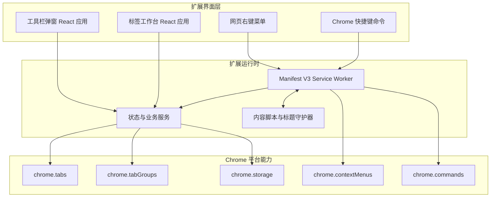

# Tabloom Chrome 插件技术架构文档

## 1. 架构设计



架构采用“轻界面、集中服务、Chrome 状态为准”的原则。标签页和标签组的真实状态始终从 Chrome API 读取；本地存储只保存用户偏好、自定义标题和必要的手工覆盖标记。

## 2. 技术选型

- 扩展框架：WXT，负责 Manifest V3、开发热更新、多入口构建和可加载产物生成。
- 界面：React 18 + TypeScript。
- 样式：原生 CSS Modules/CSS 变量，不引入大型组件库。
- 状态管理：React Hooks + 小型领域服务，不引入全局状态库。
- 浏览器 API：WXT 提供的跨浏览器 `browser` 接口类型；目标平台仅声明 Chrome。
- 数据持久化：`chrome.storage.local` 保存设置，`chrome.storage.session` 保存按标签页实例绑定的自定义标题。
- 测试：Vitest 负责领域逻辑单测，Testing Library 负责核心 React 交互测试。
- 代码质量：ESLint + TypeScript 严格模式。
- 后端与数据库：无。
- 网络依赖：运行时无外部服务，插件离线可用。

## 3. 扩展入口与路由

| 入口 | 产物 | 用途 |
|---|---|---|
| `entrypoints/background.ts` | Service Worker | 注册右键菜单、处理命令、监听标签事件、编排分组 |
| `entrypoints/content.ts` | 内容脚本 | 修改并守护 `document.title`，显示快捷重命名输入 |
| `entrypoints/popup/` | `popup.html` | 当前标签页重命名与快速整理 |
| `entrypoints/manager/` | `manager.html` | 多窗口标签分组工作台 |

插件内部不使用前端路由库。弹窗和工作台是两个独立页面入口，减少包体积和状态耦合。

## 4. Manifest V3 能力声明

### 4.1 权限

| 权限 | 原因 |
|---|---|
| `tabs` | 查询标签 URL、标题、窗口、激活状态及执行分组 |
| `tabGroups` | 查询、命名、着色、折叠和更新 Chrome 标签组 |
| `storage` | 保存标题会话状态、设置及手工覆盖标记 |
| `contextMenus` | 注册网页内容区的“重命名当前标签页”菜单 |
| `commands` | 注册快速重命名键盘命令 |
| `<all_urls>` 主机权限 | 在普通 HTTP/HTTPS 页面注入标题守护内容脚本 |

不申请历史记录、书签、下载、剪贴板或远程代码权限。

### 4.2 快捷键

```json
{
  "rename-current-tab": {
    "suggested_key": {
      "default": "Ctrl+Shift+E",
      "mac": "Command+Shift+E"
    },
    "description": "重命名当前标签页"
  }
}
```

快捷键冲突时，用户通过 `chrome://extensions/shortcuts` 重新绑定。

## 5. 核心模块

| 模块 | 职责 |
|---|---|
| `domain-service` | 校验 URL、提取完整主机名、生成可读分组名 |
| `color-service` | 将域名稳定映射到 Chrome 原生标签组颜色 |
| `title-service` | 保存、查询、清除标签实例标题，向内容脚本同步 |
| `group-service` | 查询窗口状态、按域名整理、创建组、移动或移出标签 |
| `settings-service` | 管理自动整理开关与版本化默认设置 |
| `message-contracts` | 定义 UI、后台、内容脚本之间的判别联合消息类型 |
| `chrome-errors` | 将受限页面、标签消失、权限问题转换为用户可读错误 |

## 6. 数据模型

### 6.1 设置

```ts
interface ExtensionSettings {
  schemaVersion: 1;
  autoGroupEnabled: boolean;
  groupSingleTabDomains: boolean;
}
```

默认开启自动整理，但只处理未分组标签。默认允许单标签域名成组，以保证 Merlin 页面打开后立即具有颜色识别。

### 6.2 自定义标题会话

```ts
interface TabTitleOverride {
  tabId: number;
  title: string;
  updatedAt: number;
}

type TabTitleOverrideMap = Record<string, TabTitleOverride>;
```

该数据写入 `storage.session`。标签关闭时由后台监听器清理，浏览器重启后不恢复到新标签实例，避免 URL 级误匹配。

### 6.3 手工覆盖

```ts
interface ManualTabPreference {
  tabId: number;
  mode: "manual-group" | "keep-ungrouped";
  updatedAt: number;
}
```

该数据同样按浏览器会话保存。自动整理监听器发现覆盖标记时跳过对应标签；用户主动点击“重新按域名整理”时可清除当前窗口的覆盖标记。

### 6.4 工作台视图模型

```ts
interface TabCard {
  id: number;
  windowId: number;
  groupId: number;
  title: string;
  url?: string;
  hostname?: string;
  favIconUrl?: string;
  active: boolean;
  pinned: boolean;
  customTitle?: string;
}

interface GroupColumn {
  id: number | "ungrouped";
  windowId: number;
  title: string;
  color: chrome.tabGroups.ColorEnum | "neutral";
  collapsed: boolean;
  tabs: TabCard[];
}
```

## 7. 消息协议

```ts
type RuntimeRequest =
  | { type: "TITLE_GET"; tabId: number }
  | { type: "TITLE_SET"; tabId: number; title: string }
  | { type: "TITLE_CLEAR"; tabId: number }
  | { type: "TITLE_PROMPT"; initialValue?: string }
  | { type: "GROUP_AUTO"; windowId: number; force?: boolean }
  | { type: "GROUP_MOVE"; tabId: number; groupId: number }
  | { type: "GROUP_CREATE"; windowId: number; title: string; color: ChromeGroupColor }
  | { type: "GROUP_UNGROUP"; tabId: number }
  | { type: "WORKSPACE_GET"; windowId?: number };

interface RuntimeResponse<T = unknown> {
  ok: boolean;
  data?: T;
  error?: {
    code: "RESTRICTED_PAGE" | "TAB_NOT_FOUND" | "INVALID_URL" | "CHROME_API_ERROR";
    message: string;
  };
}
```

所有跨上下文消息都必须返回结构化结果，不依赖未捕获异常向 UI 传递错误。

## 8. 关键流程设计

### 8.1 标题守护

1. 内容脚本启动后向后台查询当前 `tabId` 是否存在标题覆盖。
2. 存在覆盖时记录网站原始标题，并更新 `document.title`。
3. `MutationObserver` 监听 `<title>` 内容变化；网站再次改标题时，在微任务中重应用覆盖值。
4. 后台收到标题设置或清除请求后，先更新会话存储，再通知内容脚本。
5. 清除时断开守护状态，并恢复内容脚本最近捕获的非覆盖标题。
6. `tabs.onRemoved` 触发时删除标题和手工偏好记录。

### 8.2 自动域名分组

1. 查询目标窗口的全部标签和已有标签组。
2. 排除固定标签、受限 URL、无 `tabId` 标签、已有组标签和手工保持未分组标签。
3. 用 `new URL(url).hostname.toLowerCase()` 生成域名键。
4. 优先复用标题等于域名的已有自动组；否则调用 `tabs.group` 创建组。
5. 调用 `tabGroups.update` 设置域名标题和稳定颜色。
6. `tabs.onCreated` 与 `tabs.onUpdated` 仅在 URL 稳定且自动开关开启时调度，使用短延迟合并重复事件。

### 8.3 拖拽分组

1. 标签卡片 `dragstart` 写入 `tabId`，目标列在 `dragover` 时提供高亮。
2. 拖到已有组时调用 `tabs.group({ tabIds, groupId })`。
3. 拖到未分组区域时调用 `tabs.ungroup(tabIds)` 并写入 `keep-ungrouped`。
4. 拖到空的新组时先用该标签创建组，再更新组标题和颜色。
5. API 成功后重新读取 Chrome 状态，不做长期乐观缓存。
6. 键盘用户通过卡片菜单执行相同服务方法。

## 9. 目录结构

```text
merlin-tab-manager/
├── .trae/documents/
├── assets/
├── components/
├── entrypoints/
│   ├── background.ts
│   ├── content.ts
│   ├── manager/
│   └── popup/
├── lib/
│   ├── chrome/
│   ├── domain/
│   ├── messages/
│   └── storage/
├── tests/
├── AGENTS.md
├── README.md
├── package.json
├── tsconfig.json
└── wxt.config.ts
```

## 10. 安全与隐私

- 不上传、统计或远程同步 URL、标题和分组信息。
- 不执行远程脚本，不使用 `eval`，满足 Chrome Web Store Manifest V3 CSP。
- favicon 仅使用 Chrome 已提供的 `favIconUrl`；加载失败时回退到本地图标。
- UI 渲染标题、URL 和组名时仅作为文本节点，不使用 `innerHTML`。
- 内容脚本只读取和修改 `<title>`，不采集网页正文、表单或用户输入。

## 11. 测试与交付

### 11.1 自动化测试

- 域名提取：HTTP/HTTPS、端口、大小写、无效 URL、受限协议。
- 颜色映射：确定性、颜色枚举合法性、不同域名分布。
- 分组计划：跳过已有组、固定标签和手工覆盖，正确复用域名组。
- 标题状态：设置、覆盖、清除和标签关闭清理。
- React 交互：重命名表单、自动整理按钮、新建组表单、拖拽与键盘移动入口。

### 11.2 构建验收

- `npm run typecheck`
- `npm run lint`
- `npm test`
- `npm run build`
- 在 Chrome 扩展管理页加载 `.output/chrome-mv3`，手工验证普通网页和受限页面。

### 11.3 交付物

- 可直接开发和构建的源码。
- `.output/chrome-mv3` 可加载目录。
- 打包后的 zip 文件。
- 中文 `README.md` 安装与使用说明。
- 面向后续 AI 维护的 `AGENTS.md`。
